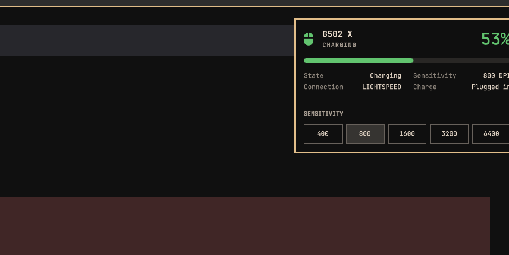

# G502 X for Omarchy

A bar widget for the Logitech G502 X LIGHTSPEED. The mouse on the bar turns **green, yellow, or red** with the charge. Click it for percent, charging state, LIGHTSPEED, and DPI presets — the same panel language as stock power and network.



## Store blurb

**G502 X LIGHTSPEED in the Omarchy bar.** A green / yellow / red mouse for charge (yellow under 50%, red under 25%), then a panel with percent, charging vs discharging, and one-tap DPI (400–6400). Hides when the mouse is gone. Low-battery notification when you are about to run out.

## What it shows

- **Bar** — mouse glyph only, colored by charge: green at 50%+, yellow under 50%, red under 25%
- **Panel** — percent, charging or discharging, LIGHTSPEED, current DPI
- **Sensitivity** — 400 / 800 / 1600 / 3200 / 6400, same control style as power profiles
- **Low battery** — one critical notification when discharging hits the threshold (default 15%)

## Requirements

- Omarchy (omarchy-shell)
- A Logitech G502 X LIGHTSPEED on the LIGHTSPEED receiver (wireless PID `409F`)
- Charge comes from the kernel HID++ battery. **No sudo or pkexec is required.**
- DPI read/write uses the `logitech_receiver` Python module from Solaar. On Omarchy: `omarchy pkg add solaar`. If that library is missing, charge still works and DPI shows as —.

## Install

```bash
omarchy plugin add https://github.com/Quarezz/omarchy-g502x.git --enable
```

Place it next to Bluetooth if it did not land there:

```bash
omarchy bar put morf.g502x --after omarchy.bluetooth
```

Or **Omarchy menu → Plugins**.

## Uninstall

```bash
omarchy plugin disable morf.g502x
omarchy plugin remove morf.g502x
```

Nothing else is written. Removing the plugin does not change onboard mouse profiles.

## Settings

| Key | Default | Description |
| --- | --- | --- |
| `lowBatteryPercent` | 15 | Notify once when discharging reaches this percent (5–40). |

## License

MIT. Plugins run unsandboxed inside omarchy-shell; review the source before you enable it.
